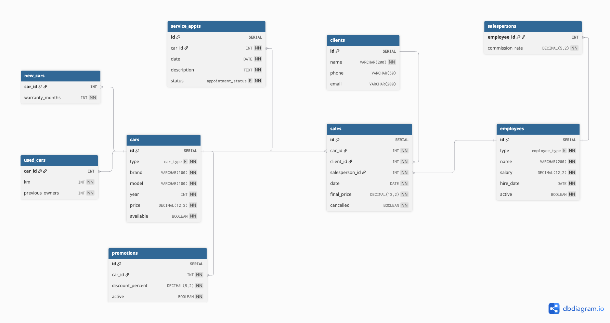

# Next Car Dealership

Java desktop app for a car dealership. Manage inventory (new and used cars), record sales, and keep client records. Data is stored in PostgreSQL; the main UI is built with JavaFX.

## Running

This project does **not** use Maven. Build and run everything with `build.sh` from the project root.

### Database

You need a local **PostgreSQL** instance. Copy `src/resources/db.properties.example` to `src/resources/db.properties` and set your connection details. For development, a **Docker Postgres 16** image was used.

### Commands

```bash
./build.sh gui      # JavaFX UI
./build.sh compile  # compile only (output in out/)
./build.sh console  # console demo (Main.java)
```

On first run, `build.sh` downloads the JavaFX SDK if it is not already in `lib/`.

## Dependencies

| Dependency                        | Role                                                           |
| --------------------------------- | -------------------------------------------------------------- |
| **JDK** (Java 26)                 | Language and runtime                                           |
| **JavaFX 26** (`javafx.controls`) | Desktop UI; downloaded automatically by `build.sh` into `lib/` |
| **PostgreSQL JDBC driver 42.7.5** | Connects to the database (`lib/postgresql-42.7.5.jar`)         |
| **PostgreSQL 16**                 | Database server (not bundled; run locally or via Docker)       |

## Architecture

The app is split into four layers:

1. **UI** (`src/ui/`) — JavaFX views and dialogs.
2. **Service** (`src/service/`) — business rules.
3. **Repository** (`src/repository/`) — SQL queries against PostgreSQL.
4. **Database** (`src/db/`) — a single `DatabaseConnection` class reads `db.properties` and opens JDBC connections.

## Data

The full schema lives in `sql/schema.sql`.



### Enums

| Type                 | Values            |
| -------------------- | ----------------- |
| `car_type`           | `NEW`, `USED`     |
| `employee_type`      | `SALESPERSON`     |
| `appointment_status` | `PENDING`, `DONE` |

### Relationships

| From                       | To             | Notes                                           |
| -------------------------- | -------------- | ----------------------------------------------- |
| `new_cars.car_id`          | `cars.id`      | one-to-one; row exists only for `NEW` cars      |
| `used_cars.car_id`         | `cars.id`      | one-to-one; row exists only for `USED` cars     |
| `salespersons.employee_id` | `employees.id` | one-to-one; row exists only for salespersons    |
| `sales.car_id`             | `cars.id`      | many sales can reference the same car over time |
| `sales.client_id`          | `clients.id`   | one client can have many sales                  |
| `sales.salesperson_id`     | `employees.id` | one employee can handle many sales              |
| `service_appts.car_id`     | `cars.id`      | one car can have many appointments              |
| `promotions.car_id`        | `cars.id`      | one car can have many promotions                |

Deleting a car or employee cascades into `new_cars`, `used_cars`, and `salespersons` respectively. Indexes on brand, availability, sales dates, and active promotions support common lookups.

### Data access

The app reads and writes data through JDBC. `DatabaseConnection` (`src/db/`) is a singleton: it loads `db.properties` once and opens a new connection on each call to `getConnection()`. Every repository in `src/repository/` extends `GenericRepository`, which holds the shared SQL helpers (`query`, `executeUpdate`, and related methods) and defines the CRUD methods each repository implements.

## Model classes

Domain objects in `src/interfaces/model/`:

- **Car** — Base type for inventory items: brand, model, year, price, condition, availability, and discount.
- **NewCar** — Car with zero kilometers and a warranty length in years.
- **UsedCar** — Car with mileage and a count of previous owners.
- **Client** — Buyer: name, phone, and email.
- **Employee** — Base type for staff: name, salary, hire date, and whether they are still active.
- **Salesperson** — Employee who sells cars; adds a commission rate.
- **Sale** — A client buying a car from a salesperson on a date, with the price paid; can be cancelled.
- **ServiceAppointment** — Service booked for a car on a given date; status is pending or done.
- **Promotion** — Discount on a specific car; can be turned on or off.
- **SalesReport** — Totals and list of sales between two dates; prints a text summary.

## Services

Business logic in `src/service/`:

- **CarService** — Add, remove, and update cars; change price; search by brand, price, or year; apply a promotion; list available cars sorted by price.
- **ClientService** — Add, update, and remove clients; delete is blocked if the client has sales.
- **SaleService** — Register a sale and mark the car as sold; cancel or delete a sale; add or deactivate salespersons; assign a salesperson to a sale; build a sales report for a date range; list sales and a client’s purchase history.
- **ServiceAppointmentService** — Schedule service for a car; mark an appointment as done; list appointments by status.
- **AuditService** — Writes an audit trail to `audit.csv`; see [Audit log](#audit-log).

## Audit log

`AuditService` (`src/service/AuditService.java`) records when selected service operations run. It is a singleton: other classes call `AuditService.getInstance().logAction("ACTION_NAME")` after the operation succeeds. Sale registration uses `AuditSaleObserver` instead, which logs `REGISTER_SALE`.

Output goes to `audit.csv` in the working directory (the project root when you run via `build.sh`). The file is created on first write; later entries are appended. Each line looks like:

```
ADD_CAR, 2026-05-31T14:30:00
```

Read-only calls (for example `getInventory` or `findCarById`) are not logged.

## Design patterns

A few patterns show up in specific places; the rest of the app is plain layered Java (UI → service → repository).

| Pattern | Where | What it does |
| ------- | ----- | ------------ |
| **Singleton** | `DatabaseConnection`, `AuditService` | One shared instance for DB config and audit logging. |
| **Repository** | `GenericRepository` and its subclasses | Hides SQL behind CRUD methods per entity. Shared query helpers live in the base class (template method). |
| **Factory + Builder** | `CarFactory`, `CarBuilder` | `CarBuilder` collects fields step by step; `CarFactory` picks `NewCar` or `UsedCar` from the type. Used in the UI and console demo. |
| **Decorator** | `PromotionDecorator` | Wraps a `Car` to format price display when a discount is active. |
| **Observer** | `SaleSubject`, `AuditSaleObserver`, `SalesReportObserver` | After a sale is registered, observers log it to `audit.csv` and update an in-memory sales report without `SaleService` calling each one directly. |

## UI

The desktop UI lives in `src/ui/` and starts from `CarDealershipApp`. `AppContext` creates the service instances once; each screen receives only the services it needs.

`MainView` is the shell: a menu bar switches between three screens inside a single window (960×600). Labels and messages are in Romanian.

| Screen | Class | What you can do |
| ------ | ----- | --------------- |
| **Inventory** | `InventoryView` | List cars in a table; add (`AddCarDialog`), edit (`EditCarDialog`), or delete; search by brand. New and used cars use different fields in the add dialog. |
| **Sales** | `SaleView` | List sales; register a sale (pick client, available car, salesperson, and date); cancel or delete a sale. |
| **Clients** | `ClientView` | List clients; add, edit, or delete through a simple form dialog. |

Each screen follows the same layout: a toolbar with action buttons and a `TableView` for the data. Dialogs collect input; `AlertHelper` shows errors, confirmations, and info boxes. After a change, the active screen reloads its table from the service layer.

Service appointments and promotions exist in the database and services but are not exposed in the UI yet.
